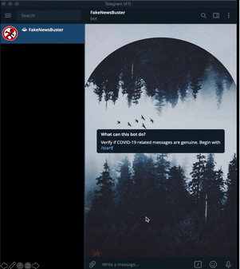

# Covid Fake News Buster
This application was written as part of the CodeForCorona 2020 challenge.

It consists of a flask backend API as well as a telegram bot front-end.

Users can forward suspicious news to our telegram bot @stopfakenewsbot, which will then return a list of aggregated (and reliable) news articles.
Users can then vote if they think this piece of news is real or fake. 

By crowdsourcing the authenticity of each chain chain text message, we allow the people to take responsiblity of the media they consume, and act as watchdogs for the rest of the world during these trouble times

Our devpost page:
https://devpost.com/software/fakenewsbuster

Our video demonstration:
https://youtu.be/vylxfnWft94




## Technologies used 
- Spacy
- Flask
- Telebot
- Googlesearch

## Running the API service

```bash
$ python3 start_backend.py
```

## Running the telegram bot

```bash
$ python3 bot.py
```
